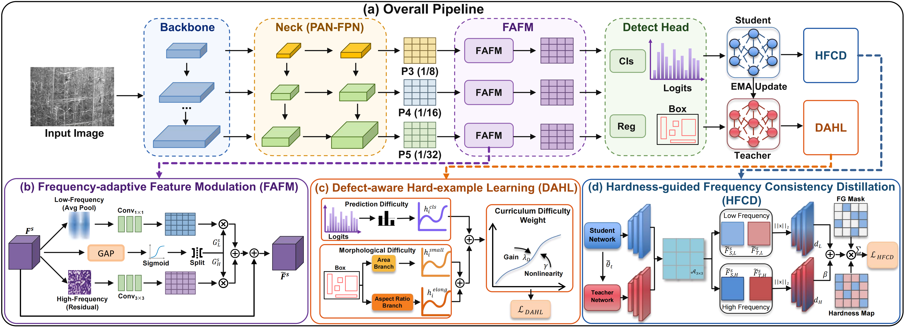

<div align="center">
  <h1>Multi-Scale Frequency-Aware and Difficulty-Adaptive Learning for Industrial Surface Defect Detection</h1>
</div>

## 📬 News

- **2026-08-28**: The training entry was consolidated into dataset-specific YAML configurations.
- **2026-08-28**: The public training setting was fixed to the complete `Ours` model based on YOLO11n.

## 🛠️ Method Overview

<p align="center">
  
</p>

This project targets industrial surface-defect detection, where small, elongated, low-contrast, and texture-confusable defects are common. The detector uses YOLO11n as the base architecture and introduces three complementary components:

- **FAFM — Frequency-Adaptive Feature Modulation.** Inserted after the P3, P4, and P5 feature-fusion outputs. It decomposes each feature map into a local low-frequency component and a high-frequency residual, then uses input-adaptive gates to modulate both branches before residual fusion.
- **DAHL — Difficulty-Aware Hardness Loss.** Reweights positive anchors according to classification uncertainty and target morphology. Small and elongated defects, as well as low-confidence positives, receive stronger supervision as training progresses.
- **HFCD — Hardness-guided Frequency Consistency Distillation.** Uses the EMA model as a teacher during training. Student and teacher P3/P4/P5 features are split into low- and high-frequency parts, and their consistency loss is emphasized on hard foreground anchors.

## 🕹️ Getting Started

### Environment Setup

Create a Python environment with a PyTorch build compatible with your CUDA driver, then install the project dependencies. A typical setup is:

```shell
conda create -n dahl-fafm-hfcd python=3.10 -y
conda activate dahl-fafm-hfcd

# Install a PyTorch build suitable for your CUDA environment first.
pip install torch torchvision
pip install pyyaml opencv-python matplotlib pandas seaborn psutil requests scipy ultralytics-thop
```

This repository contains a modified local `ultralytics/` package. Run commands from the repository root so that Python imports this local implementation.

### Dataset Configuration

Each dataset has an independent experiment configuration under `configs/`.

The datasets used in this project are:

* **NEU-DET**: [Official Website](http://faculty.neu.edu.cn/songkechen/zh_CN/zdylm/263270/list/)
* **GC10-DET**: [Dataset Download](https://pan.baidu.com/share/init?surl=eWz-4PHrNf_m_C8P3GJybQ)
  **Extraction code:** `2drc`

### Training

The default launcher trains the NEU-DET configuration:

```shell
python train.py --config configs/gc10_det.yaml
```

Training runs for 100 epochs with image size `640`, batch size `16`, and 8 dataloader workers. The output folder uses the configuration filename, for example `configs/neu_det.yaml` writes to `runs/neu_det/`.

### Evaluation and Prediction Export

After training, evaluate `best.pt` and export validation-set predictions:

```shell
python test.py runs/neu_det/weights/best.pt --dataset neu_det --device 0
```

The evaluation script writes:

```text
runs/neu_det/weights/results.txt
runs/neu_det/weights/predictions_val/
```

`results.txt` includes precision, recall, F1, mAP50, mAP50:95, parameter count, GFLOPs, and FPS. The prediction directory contains rendered images and YOLO-format prediction text files.

## 🗓️ TODO

- [x] Release the Ours implementation
- [x] Provide dataset-specific training configurations
- [x] Provide training and validation entry points
- [ ] Release trained checkpoints and benchmark tables
- [ ] Add reproducibility logs for all supported datasets

## 🏷️ License

This repository includes a modified version of Ultralytics YOLO. Please review the licensing terms of the upstream Ultralytics project before redistribution or commercial use.

## 🫡 Acknowledgment

This implementation is built on the Ultralytics YOLO codebase. We thank the Ultralytics community for the detection framework and training infrastructure.

## 📟 Contact

For questions, bug reports, or reproducibility issues, please open a GitHub issue with the configuration file, command, environment details, and complete error log.
